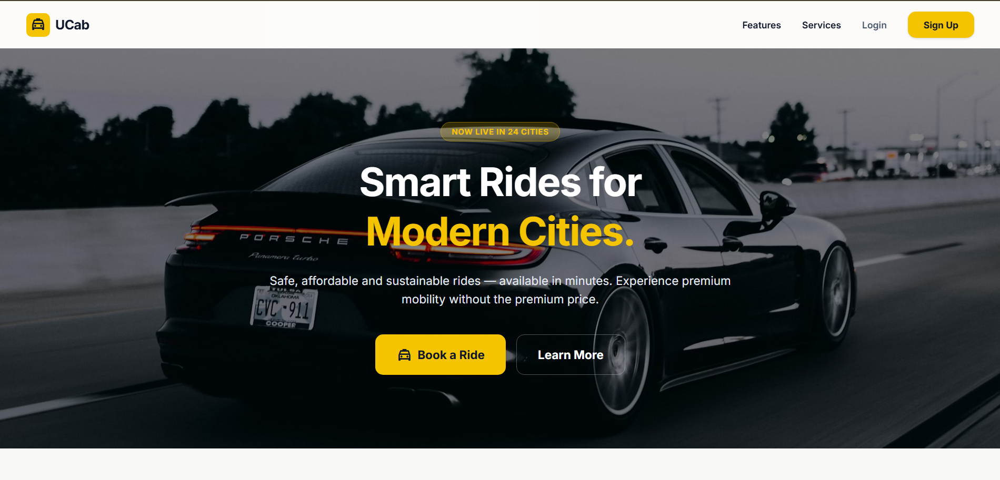
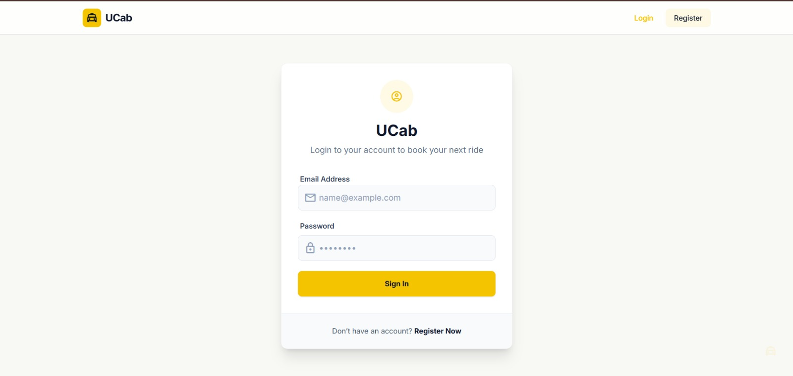
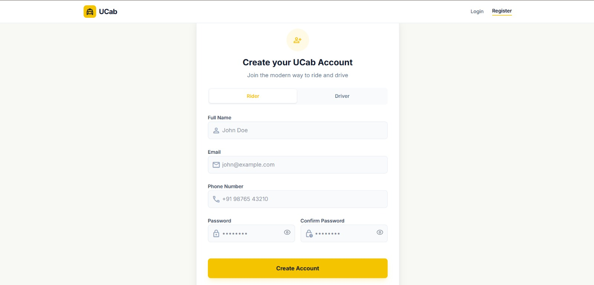
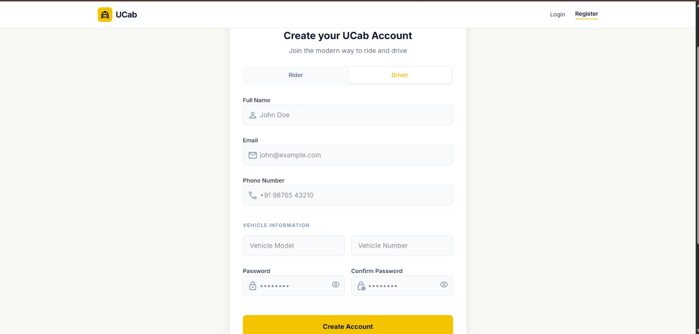
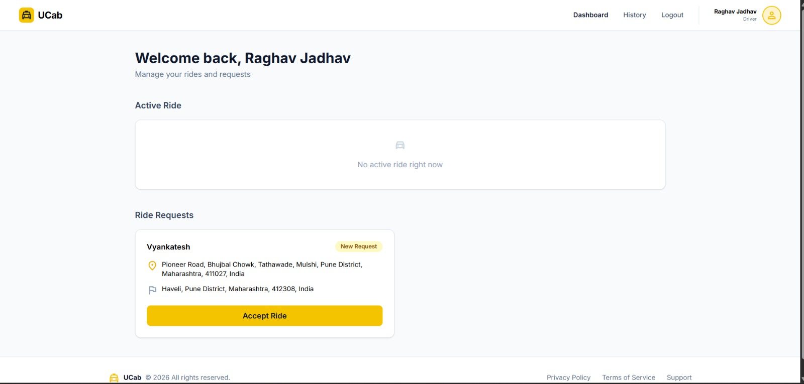
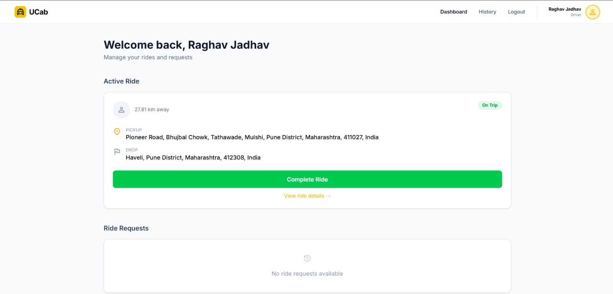
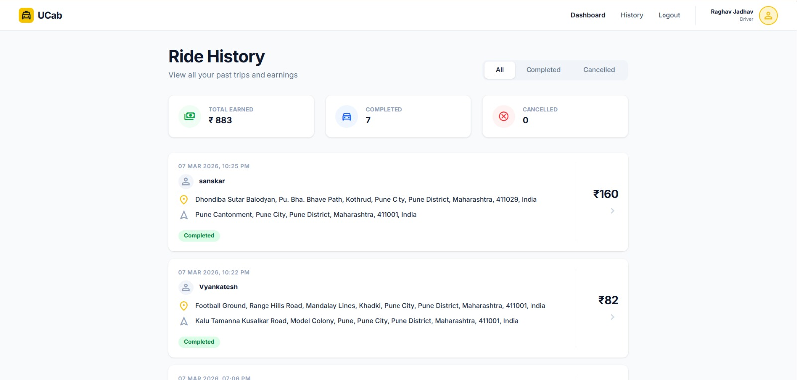

# 🚖 UCAB Cab Booking System

UCAB is a comprehensive, full-stack cab booking platform built with the MERN stack. It provides a seamless experience for both passengers and drivers, allowing users to book rides with pickup and drop-off locations, while providing drivers with the tools to accept, track, and complete rides in real-time.

---

## 💻 Tech Stack

- **Frontend:** React (Vite), React Router, Axios, TailwindCSS
- **Backend:** Node.js, Express.js
- **Database:** MongoDB with Mongoose
- **Maps & Navigation:** React Leaflet with OpenStreetMap
- **Authentication:** JWT (JSON Web Tokens) with Access & Refresh Tokens stored securely in HTTP-only cookies

---

## ✨ Features

- **Authentication & Security:** Secure User and Driver registration/login with role-based access control (RBAC).
- **Ride Booking Engine:** Users can seamlessly book rides by specifying pickup and drop-off locations.
- **Driver Ecosystem:** Dedicated interface for drivers to accept requested rides and manage ongoing trips.
- **Real-time Lifecycle Tracking:** End-to-end tracking of ride status (Requested -> Accepted -> Ongoing -> Completed).
- **Interactive Maps:** Visual route and location representation utilizing React Leaflet.
- **Payment Integration:** Secure mock payment system processed upon ride completion.
- **User Dashboard:** Ride history logs and comprehensive profile management for both users and drivers.

---

## 🏗 System Architecture

The project strictly follows the **MVC (Model-View-Controller)** architecture to maintain code modularity and separation of concerns:
- **Models:** Mongoose schemas defining database structure (Users, Rides, Payments).
- **Controllers:** Business logic handling data manipulation and API responses.
- **Routes:** API endpoints definitions delegating requests to specific controllers.
- **Middlewares:** Request interceptions for tasks like JWT verification, error handling, and role validation.

---

## 📁 Folder Structure

```text
ucab-mern-cab-booking/
├── client/                # React Vite Frontend Environment
│   ├── src/
│   │   ├── assets/        # Static assets (images, icons)
│   │   ├── components/    # Reusable UI components
│   │   ├── context/       # React Context API for global state
│   │   ├── pages/         # Page-level components
│   │   ├── services/      # Axios API integration layer
│   │   └── App.jsx        # Routing configuration
│   └── package.json
└── server/                # Node.js/Express Backend Environment
    ├── src/
    │   ├── controllers/   # Request handlers
    │   ├── db/            # Database connection setup
    │   ├── middlewares/   # Custom Express middlewares
    │   ├── models/        # Mongoose data models
    │   ├── routes/        # Express routers
    │   ├── utils/         # Helper functions (ApiError, ApiResponse)
    │   ├── app.js         # Express app setup
    │   └── server.js      # Server entry point
    ├── .env               # Environment configuration
    └── package.json
```

---

## ⚙️ Installation

1. **Clone the repository:**
   ```bash
   git clone https://github.com/yourusername/ucab-mern-cab-booking.git
   cd ucab-mern-cab-booking
   ```

2. **Install Backend Dependencies:**
   ```bash
   cd server
   npm install
   npm install nodemon
   ```

3. **Install Frontend Dependencies:**
   ```bash
   cd ../client
   npm install
   ```

---

## 🔐 Environment Variables

Create `.env` files in both the `server` and `client` directories.

**`server/.env`**
```env
PORT=8000
MONGODB_URI=your_mongodb_connection_string
CORS_ORIGIN=http://localhost:5173
ACCESS_TOKEN_SECRET=your_access_token_secret
ACCESS_TOKEN_EXPIRY=1d
REFRESH_TOKEN_SECRET=your_refresh_token_secret
REFRESH_TOKEN_EXPIRY=10d
```

**`client/.env`**
```env
VITE_API_URL=http://localhost:8000/api/v1
```

---

## 🚀 Run Locally

1. **Start the Backend Server:**
   ```bash
   cd server
   npm run dev
   ```

2. **Start the Frontend Client:**
   ```bash
   cd client
   npm run dev
   ```

3. **Access the application:**
   Open [http://localhost:5173](http://localhost:5173) in your browser.

---

## 📡 API Endpoints

### Auth / Users (`/api/v1/users`)
- `POST /register` - Register a new user or driver
- `POST /login` - Login user/driver
- `POST /logout` - Logout user (clears cookies)
- `POST /refresh-token` - Refresh access token
- `GET /current-user` - Get logged-in user details

### Rides (`/api/v1/rides`)
- `POST /create` - Book a new ride
- `GET /history/user` - Get user's ride history
- `GET /history/driver` - Get driver's ride history
- `GET /driver/active` - Get driver's current active ride
- `GET /user/active` - Get user's current active ride
- `POST /:rideId/accept` - Driver accepts a ride
- `POST /:rideId/start` - Driver starts a ride
- `POST /:rideId/complete` - Driver completes a ride
- `POST /:rideId/cancel` - Cancel a ride

---

## 🔮 Future Improvements

- **WebSockets:** Migrate from API polling to Socket.io for true real-time location tracking and instant ride request notifications.
- **Geospatial Queries:** Implement MongoDB `$geoNear` to only dispatch ride requests to drivers within a strict radius of the pickup location.
- **Advanced Authentication:** Implement OTP validations for ride starts and phone number verification.
- **Payment Gateway:** Integration with Stripe or Razorpay for live fiat transactions and automated driver commission payouts.
- **Scheduled Rides:** Allowing users to request rides in advance.

## 📸 Screenshots

### Landing Page


### Authentication
#### Login


#### Rider (User) Registration


#### Driver Registration


### Rider (User) UI
#### User Dashboard


#### Book a Ride


#### User Profile


#### User Ride History


### Driver UI
#### Driver Dashboard


#### Driver Active Ride


#### Driver History
